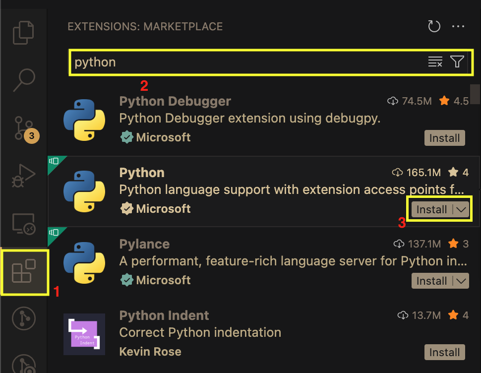

## VS Code 환경 설정

Cursor 등 Python과 Node 개발용으로 이미 사용하고 있는 IDE가 있다면 VS Code를 설치할 필요가 없다. 

### VS Code 설치
[https://code.visualstudio.com/](https://code.visualstudio.com/)

### Python Extension 설치



## git 환경 설정
### git 설치
#### Mac OS
```
brew install git
```

#### Windows
https://github.com/git-for-windows/git/releases/download/v2.51.2.windows.1/Git-2.51.2-64-bit.exe

### github에서 repository를 복사
```shell
git clone https://github.com/MIDASIT-Co-Ltd/tgc-s4-agent-tutorial.git
```
또는
```shell
git@github.com:MIDASIT-Co-Ltd/tgc-s4-agent-tutorial.git
```

## uv (파이썬 패키지 매니저) 환경 설정 

### uv 설치

#### Mac OS
```shell
brew install uv
```
또는
```shell
curl -LsSf https://astral.sh/uv/install.sh | sh
```
#### Windows
```shell
powershell -ExecutionPolicy ByPass -c "irm https://astral.sh/uv/install.ps1 | iex"
```
#### pip
이미 파이썬이 설치 돼있는 경우에는 pip를 이용한 설치도 가능하다
```shell
pip install uv
```

참고 https://docs.astral.sh/uv/getting-started/installation/

### 특정 python 버젼 설치
특정 python 버젼을 설쳐해야 할 경우 아래의 명렁어로 설치 할 수 있다. (python 3.12를 설치할 경우)
```shell
uv python isntall 3.12
```

##  Node.js 환경 설정

### nvm 설치

#### Mac OS

```bash
brew install nvm
```

~/.zshrc 에 아래 내용을 복사하며 붙여넣는다.
```bash
export NVM_DIR="$HOME/.nvm"
[ -s "$(brew --prefix nvm)/nvm.sh" ] && . "$(brew --prefix nvm)/nvm.sh"
[ -s "$(brew --prefix nvm)/etc/bash_completion.d/nvm" ] && . "$(brew --prefix nvm)/etc/bash_completion.d/nvm"
```
#### Windows
https://github.com/coreybutler/nvm-windows/releases 에서 nvm-setup.exe를 다운받아 설치

### npm 설치
```shell
nvm install lts
```
자신이 선호하는 버젼으로 설치해도 좋다.

### pnpm 설치
```shell
npm install -g pnpm
```

## 파이썬 가상환경 설정

### 프로젝트 파이썬 가상환경 생성
```shell
cd agents-python
cd agent-adk
uv sync
```


### 프로젝트 파이썬 가상환경 활성화
agents-python/agent-adk 디렉토리에서 아래 명령어 실행
```bash
source .venv/bin/activate
```
